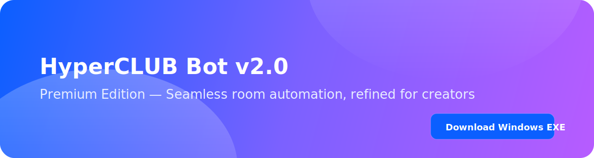

# 🤖 HyperCLUB Bot v2.0

<div align="center">



<br/><br/>

<a href="https://neocat.store/website/site/home">
  
  </a>

<br/>


<br/>

**The Most Advanced Clubhouse Bot with AI‑Powered Automation**  
*by [cyberkallan](https://github.com/cyberkallan)* · [Telegram](https://t.me/deno_tech)

</div>

---

## 🎁 FREE TRIAL — Try HyperCLUB Now

<div align="center">

<picture>
  
</picture>

<br/>

<strong style="font-size:18px">Want free trial keys?</strong>

<br/>


<p style="color:#64748b">Experience the premium automation flow — no commitment, just speed and quality.</p>

<a href="https://neocat.store/website/trynow">
  
</a>

</div>

---

## 🚀 **FEATURES**

### ✨ **Core Features**
- 🤖 **AI-Powered User Management** - Smart welcome messages and speaker management
- 🔐 **Secure Licensing System** - Online validation with device management
- 📱 **Cross-Platform Support** - Windows EXE & Android Termux versions
- ⚡ **Real-time Monitoring** - Live room activity tracking
- 🎯 **Customizable Messages** - Easy text file configuration
- 🔄 **Auto-Response System** - Intelligent user interaction handling

### 🌟 **Premium Features**
- 📊 **Analytics Dashboard** - Performance tracking and statistics
- 👥 **VIP User Management** - Special treatment for premium users
- 🛡️ **Anti-Spam Protection** - Smart filtering and blocking
- 🔔 **Notification System** - Real-time alerts and updates
- 🎨 **Custom Themes** - Personalized bot appearance
- 📈 **Performance Optimization** - Fast and efficient operation

---

<div align="center">


</div>

## 📱 **HIGHLIGHTED: ANDROID TERMUX VERSION**

<div align="center">

### 🎯 **Perfect for Mobile Users!**


**Run HyperCLUB Bot directly on your Android device!**

</div>

### 📋 **Termux Installation Guide**

```bash
# 1. Install Termux from F-Droid
# 2. Update packages
pkg update && pkg upgrade

# 3. Install Python and dependencies
pkg install python
pip install requests

# 4. Download the bot
wget https://raw.githubusercontent.com/cyberkallan/hyperclub-bot/main/hyperCLUB_bot_termux.py

# 5. Run the bot
python hyperCLUB_bot_termux.py
```

### 🎉 **Termux Advantages**
- ✅ **No PC Required** - Run directly on Android
- ✅ **Lightweight** - Only 14KB file size
- ✅ **Easy Setup** - Simple installation process
- ✅ **24/7 Operation** - Keep running in background
- ✅ **Mobile Optimized** - Perfect for on-the-go use

---

## 💻 **WINDOWS VERSION**

<div align="center">


**Ready-to-use executable file!**

</div>

### 🚀 **Quick Start (Windows)**
1. **Download** `hyperCLUB_bot.exe`
2. **Double-click** to run (no installation needed!)
3. **Enter** your license key
4. **Configure** your settings
5. **Start** the bot!

---

## 🔑 **LICENSING SYSTEM**

<div align="center">

### 💎 **Premium License Plans**

| Plan | Price | Duration | Devices | Features |
|------|-------|----------|---------|----------|
| **Basic** | $2 | 1 Month | 1 | Full Access |
| **Premium** | $10 | 3 Months | 5 | + Priority Support |
| **Ultimate** | $49 | Life time | 25 | + 24/7 Support |

</div>

### 🔐 **How to Get License**
1. **Contact** [@deno_tech](https://t.me/deno_tech) on Telegram
2. **Choose** your preferred plan
3. **Receive** your unique license key
4. **Activate** the bot instantly

---

## 📁 **PROJECT STRUCTURE**

```
HYPER-CLUBHOUSE/
├── assets/                         # Premium visual assets
│   ├── automation_flow.svg
│   ├── banner.svg
│   ├── banner_dark.svg
│   ├── clubhouse_mark.svg
│   ├── cta_download.svg
│   ├── divider.svg
│   └── divider_dark.svg
├── hyperCLUB_bot_obfuscated.py     # Windows/Python premium build
├── hyperCLUB_bot_termux.py         # Android (Termux) premium build
├── hyperCLUB_bot.exe               # Windows executable (portable)
├── RUN_BOT_OBFUSCATED.bat          # One‑click launcher for Python build
├── launch_message.txt              # Launch message template
├── emg1.txt                        # Welcome prefixes
├── emg2.txt                        # Welcome suffixes
├── leaving.txt                     # Leaving room templates
├── index.html                      # Premium landing (optional)
├── PROTECTION_README.md            # Premium edition overview
├── README.md                       # Main documentation
├── requirements.txt                # Python dependencies
├── CHANGELOG.md                    # Release notes
├── LICENSE                         # License
└── .gitignore                      # Git ignore rules
```

---

## 🛠️ **INSTALLATION**

### 📱 **Android (Termux) - RECOMMENDED**

```bash
# Quick installation script
curl -sSL https://raw.githubusercontent.com/cyberkallan/hyperclub-bot/main/install_termux.sh | bash
```

### 💻 **Windows**

```batch
# Download and run
# 1. Download hyperCLUB_bot.exe
# 2. Double-click to run
# 3. Follow on-screen instructions
```

---

## ⚙️ **CONFIGURATION**

### 🔧 **Basic Setup**
1. **Enter License Key** when prompted
2. **Input Channel ID** from Clubhouse
3. **Configure Token** (auto-fetch or manual)
4. **Customize Messages** in text files
5. **Add VIP/Blocked Users** as needed

### 📝 **Message Customization**
Edit the following files to customize bot responses:
- `launch_message.txt` - Bot startup message
- `speaker_welcome.txt` - Speaker welcome messages
- `vip_welcome.txt` - VIP user messages
- `periodic_messages.txt` - Periodic announcements

---

## 🎯 **FEATURES COMPARISON**

| Feature | Windows EXE | Android Termux |
|---------|-------------|----------------|
| **Installation** | No installation | Simple setup |
| **File Size** | 8.7MB | 14KB |
| **Performance** | High | Optimized |
| **Portability** | Limited | High |
| **Background** | Yes | Yes |
| **Updates** | Manual | Easy |

---

## 🚀 **QUICK START**

### 📱 **For Android Users (RECOMMENDED)**
```bash
# 1. Install Termux
# 2. Run these commands:
pkg install python
pip install requests
wget https://raw.githubusercontent.com/cyberkallan/hyperclub-bot/main/hyperCLUB_bot_termux.py
python hyperCLUB_bot_termux.py
```

### 💻 **For Windows Users**
```batch
# 1. Download hyperCLUB_bot.exe
# 2. Double-click to run
# 3. Enter license key
# 4. Configure settings
```

---

## 📊 **STATISTICS**

<div align="center">


</div>

---

## 🤝 **SUPPORT**

### 📞 **24/7 Support Available**
- **Telegram**: [@deno_tech](https://t.me/deno_tech)
- **GitHub Issues**: [Report Bug](https://github.com/cyberkallan/hyperclub-bot/issues)
- **Documentation**: [Full Guide](https://github.com/cyberkallan/hyperclub-bot/wiki)

### 🆘 **Common Issues**
- **License Issues**: Contact @deno_tech on Telegram
- **Installation Problems**: Check installation guides
- **Configuration Errors**: Verify token and channel ID
- **Performance Issues**: Ensure stable internet connection

---

## 🎨 **SCREENSHOTS**

<div align="center">

### 📱 **Termux Version in Action**


### 💻 **Windows Version**


</div>

---

## 🔄 **UPDATES**

### 📅 **Latest Version: v2.0**
- ✨ **New**: Enhanced Termux support
- 🚀 **Improved**: Performance optimization
- 🔐 **Enhanced**: Security features
- 📱 **Added**: Mobile-friendly interface
- 🎯 **Fixed**: Various bug fixes

---

## 📄 **LICENSE**

This project is licensed under the **Premium License**.  
**Copyright © 2024 cyberkallan. All rights reserved.**

### 📋 **License Terms**
- ✅ **Personal Use**: Allowed
- ✅ **Commercial Use**: Requires license
- ❌ **Redistribution**: Not allowed
- ❌ **Modification**: Not allowed without permission

---

## ⭐ **STAR THIS REPOSITORY**

If you find this project helpful, please give it a ⭐ star on GitHub!

<div align="center">

[](https://github.com/cyberkallan/hyperclub-bot)

**Support the project by starring! ⭐**

</div>

---

## 👨‍💻 **AUTHOR**

<div align="center">

### 🛡️ **cyberkallan**


**⚡ Cybersecurity Analyst | Ethical Hacker | Bug Bounty Hunter ⚡**

*Passionate cybersecurity professional with expertise in ethical hacking, penetration testing, and security analysis. Creator of advanced automation tools and security solutions.*

</div>

---

<div align="center">

**Made with ❤️ by [cyberkallan](https://github.com/cyberkallan)**

[](https://github.com/cyberkallan)
[](https://t.me/deno_tech)

</div>


